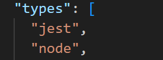

## Unit testing in ArmoniK

### Brief introduction on testing in frontend 
  Testing is a crucial part of software developement.
  
  It brings to developers more confidence on what they're working on and more quality on software. 
  
  We have traditionnaly 3 types of tests.

    Tests
    1. Unit tests
    2. Integration tests
    3. End-to-End tests

 We'll be focused on unit testing.

#### What are Unit tests ? 
 
  Unit testing is focused on writing tests for small building blocks of an application.

  It's about test every expected and unexpected behavior of units of our app. We usually write unit tests for classes, functions and small components. 
  
  We tests our classes and functions by checking their inputs and outputs in order to work more predictable and consistent code.
  
  In Javascript eco-system, you can use librairies like [Jasmine](https://jasmine.github.io/), [Jest](https://jestjs.io/) and recently [Vitest](https://vitest.dev/).

  We choose using Jest for his large popularity and adoption in Javascript community and frameworks like Angular.

  #### Jest installation 

  ArmoniK Admin GUI is developed with Angular. Angular natively offers to use Jasmine and Karma for testing. 

  As we choose using Jest, we need to delete Jasmine and Karma of our project.

  To remove Jasmine and Karma from the project, run `pnpm remove jasmine karma`.

  #### Installation of Jest library and packages

  Run `pnpm add --save-dev jest @types/jest jest-environment-jsdom ts-jest ts-node jest-preset-angular`.

  @types/jest ts-node ts-jest and jest-preset-angular are needed for jest configuration in Typescript/Angular projects. 

  jest-environment-jsdom is a package recommended by Jest documentation for DOM simulation. (https://jestjs.io/docs/tutorial-jquery). 

  #### Jest setup and configuration 

Once Jest installed, we need to declare it in our Typescript configuration file. 
in ./tsconfig.spec.json, add "jest" and "node" to property types.

  

  
  
  
  
           

